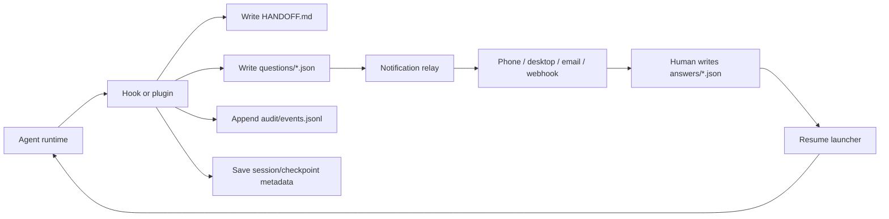
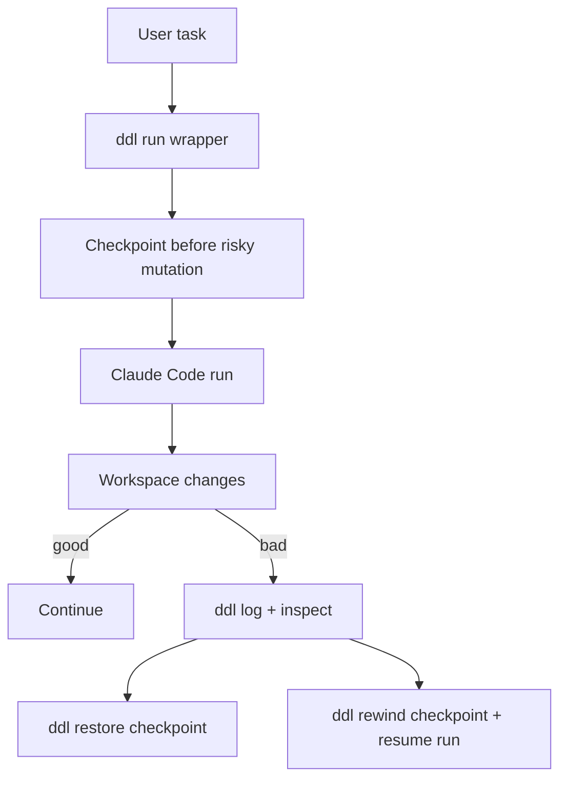
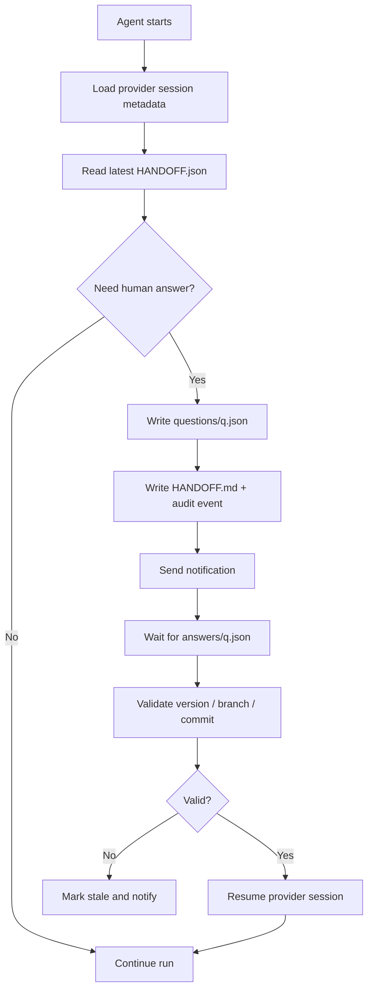

# File-Based Agent Handoff Systems for LLM Agents

## Executive summary

The short answer is **yes**: your idea already exists in parts, but the community still does **not** have one settled, cross-tool standard. The strongest first-party building blocks today come from entity["organization","Anthropic","ai company"] and entity["organization","OpenAI","ai company"]. entity["organization","Google","technology company"] and entity["organization","GitHub","software company"] also provide adjacent pieces, but not the same end-to-end “write a question to disk, notify me, resume later with preserved intent” flow. The community pattern that keeps showing up is: **repo-local handoff file + machine-readable sidecar + local transcript/checkpoint + notification relay + resume launcher**. citeturn10view0turn13view1turn15view0turn21search1turn29view0turn32view0

For the exact workflow you described, **Claude Code is the closest first-party fit today**. Its hook system can intercept `AskUserQuestion`, *defer* the tool in non-interactive mode, persist the pending tool call, and later resume the same session with an answer injected back into the deferred tool. That is unusually close to a true “sleep / wake / continue” loop. **Codex is strong, but not equivalent yet**: it has an experimental, well-designed hook system and durable local history, but several fields that would make deferred-human round-trips cleaner are currently parsed but *not supported*, and its tool interception remains incomplete for some execution paths. Gemini CLI now has a serious hook system too, but the retrieved docs do not show a first-party deferred-human handshake as complete as Claude’s. citeturn13view1turn18view0turn18view1turn18view2turn20view0turn29view0turn30view1turn30view2

The practical conclusion is blunt. If you want this **now**, the safest architecture is:

1. **A human-readable handoff** like `HANDOFF.md`.
2. **A machine-readable queue** like `questions/` and `answers/`.
3. **A local checkpoint / transcript layer** so you do not re-read the whole chat.
4. **An external notification leg** that is independent from the agent runtime.
5. **A resume command** that can relaunch the exact session or inject only the delta answer. citeturn37view1turn38search0turn38search8turn14view0turn20view0turn32view0

## Open-source project landscape

The open-source landscape splits into four families: **checkpoint wrappers**, **handoff document generators**, **context-restoration plugins**, and **cross-agent delegation bridges**. The most important point is that these are mostly **thin workflow layers** around existing agents, not full new agent runtimes. That is good news for your use case: the pattern is already simple enough to graft onto Claude Code or Codex today. citeturn37view0turn37view1turn38search0turn38search5turn37view4

| Project | Type | Core artifact / key paths | Verified maturity | What matters |
|---|---|---|---|---|
| urlyahnyshc/daedalusturn37view0 | Checkpoint wrapper | `crates/ddl/`, `docs/`, `AGENTS.md`, repo config under `~/.daedalus/repos/<repo-id>/config.json` | **3★**, **43 commits**, **0 issues** | Wraps Claude Code, checkpoints before risky mutation boundaries, supports `restore` and Claude-backed `rewind`. |
| urlwillseltzer/claude-handoffturn37view1 | Claude Code handoff plugin | `.claude-plugin/`, `.claude/`, `commands/`, `skills/handoff/`, `HANDOFF.md` | **82★**, **6 commits**, **0 issues** | The clearest “write a handoff doc and resume later” plugin in the retrieved set. |
| urlthepushkarp/handoffturn38search0 | Claude Code handoff plugin | `docs/handoff/HANDOFF.md`; `CLAUDE.md` compact-instructions pattern | Partial in retrieved pass | Focuses on preserving task state, blockers, next steps, and reloading that state across sessions. |
| urlwho96/claude-code-context-handoffturn38search8 | Session handoff plugin | `~/.claude/handoff/<session_id>.md`, `latest-handoff.md`, `latest-handoff.json` | Partial in retrieved pass | Adds a useful dual-format pattern: markdown for humans, JSON for automation, plus age / cwd guardrails. |
| urlchadthornton/reheatturn37view2 | Handoff reimplementation | Plugin / skill prompts (exact internal tree not fully extracted) | **0★** verified in retrieved page | Modern reimplementation inspired by `claude-handoff`, aimed at current Claude Code versions. |
| urlwaelmas/codeplowturn38search5 | Multi-agent memory / handoff toolkit | Marketplace-style plugin bundle | Updated **2026-04-16** in snippet | Targets “context rot” across Claude Code, Copilot CLI, Cursor, and Codex CLI. |
| urlopenai/codex-plugin-ccturn37view4 | Cross-agent bridge | Claude slash commands like `/codex:review`, `/codex:rescue`, `/codex:status`, `/codex:result`, `/codex:cancel` | Partial in retrieved pass | Lets Claude Code hand work off to Codex, including background job management. |

The table above is drawn from GitHub repo pages and search snippets retrieved during this pass. Where GitHub exposed exact counts, I used them; where the crawler only exposed README-style snippets, I marked maturity as partial rather than pretending certainty. citeturn39view0turn39view1turn39view2turn39view4turn39view5turn38search0turn38search5turn38search8turn37view4

Two projects stand out architecturally.

**Daedalus** is **not** a handoff-document writer first. It is a **checkpoint-and-rewind wrapper**. It runs Claude “inside” a safety shell, checkpoints before `Edit`, `MultiEdit`, `Write`, and configured `Bash` mutations, then lets you either restore files or restore files **and resume** the Claude-backed run. That is a stronger answer to “the model ruined my workspace late in the run” than a plain `HANDOFF.md`. The README explicitly says it is **early**, **intentionally narrow**, and **Claude-first**. citeturn37view0turn39view0turn39view1turn39view2

**claude-handoff** is the opposite end of the spectrum: deliberately **simple**, **agent-agnostic**, and file-centric. Its value is that it does not try to recreate the runtime. It captures the intent, completed work, failed attempts, decisions, and next steps into a `HANDOFF.md`, then provides `/handoff:resume`. The README is explicit that even non-Claude agents can continue if you simply tell them to read the file and carry on. citeturn37view1turn39view4turn39view5

A generic architecture that matches what these repositories converge on looks like this. citeturn37view0turn37view1turn38search0turn38search8



A **Daedalus-like** checkpoint wrapper is a different shape. citeturn37view0turn39view1



## Official hooks and APIs

There is now a real 차이 between “agent has a CLI” and “agent has official lifecycle contracts”. In the sources reviewed here, **Claude Code**, **Codex CLI**, and **Gemini CLI** are the strongest *hookable* terminal agents. **OpenAI Responses API** and the **OpenAI Agents SDK** are stronger *programmable* async primitives. **GitHub Copilot** is strongest on **persistent session storage, cloud background execution, and file-based instructions**, rather than local hook depth. citeturn10view0turn15view0turn29view0turn21search1turn21search2turn32view0turn32view2

| System | Official primitive | Event / payload shape | Resume / handoff fit | Important limits |
|---|---|---|---|---|
| urlClaude Code hooks referenceturn10view0 | Hooks, HTTP hooks, prompt hooks, agent hooks, channels, checkpointing | JSON on `stdin` for command hooks, JSON POST body for HTTP hooks; events include `SessionStart`, `UserPromptSubmit`, `PreToolUse`, `PermissionRequest`, `PostToolUse`, `Notification`, `Stop`, `SessionEnd`, more | **Best fit** for file-based handoff with deferred human input | `defer` works only in non-interactive `-p` mode, only for a single tool call in a turn; async hooks cannot block; hooks run with full user permissions |
| urlClaude Agent SDK overviewturn22view2 | SDK callbacks over the Claude Code agent loop | Hook callbacks like `PreToolUse`, `PostToolUse`, `Stop`, `SessionStart`, `SessionEnd`, `UserPromptSubmit` | Excellent for custom wrappers around question files and resume launchers | Requires API-style auth; no `claude.ai` login for third-party SDK apps |
| urlCodex Hooks docsturn15view0 | Experimental lifecycle hooks in `hooks.json` or inline `config.toml` | JSON on `stdin`, JSON on `stdout`; `SessionStart`, `PreToolUse`, `PermissionRequest`, `PostToolUse`, `UserPromptSubmit`, `Stop` | **Good fit**, but usually as a wrapper workaround rather than native deferred-human resume | Feature flag required; several useful fields are parsed but *not supported yet*; shell / tool interception is still incomplete |
| urlOpenAI Responses background mode guideturn21search1 | Async model execution with polling and stateful responses | Background responses expose status like `queued`, `in_progress`, `completed`, `failed`, `cancelled`, `incomplete` | Good backend substrate for cloud handoff services | It is an API primitive, *not* a local file-hook system by itself |
| urlOpenAI Agents SDK handoffs guideturn21search2 | Agent-to-agent handoffs as tools | Delegation tool; optional input filters can limit passed context | Good for multi-agent routing, less directly for human question files | Not a file handoff standard; you still design persistence yourself |
| urlGemini CLI hooks referenceturn29view0 | Command hooks in `settings.json` | JSON `stdin` / `stdout`; events include `BeforeTool`, `AfterTool`, `BeforeAgent`, `AfterAgent`, `BeforeModel`, `BeforeToolSelection`, `AfterModel`, `SessionStart`, `Notification` | Strong for interception and augmentation | Only command hooks; some lifecycle hooks are advisory and cannot block startup |
| urlGitHub Copilot CLI session-data docsturn32view0 and urlGitHub Copilot SDK session persistence docsturn32view1 | Local resumable session store; caller-owned `sessionId`; file-based custom instructions | Session files under `~/.copilot/session-state/`; local SQLite session store; `AGENTS.md` / `.github/copilot-instructions.md` / path-specific instruction files | Strong for durable memory and session resume | No retrieved first-party local hook system comparable to Claude / Codex / Gemini |

This comparison is grounded in first-party docs or repo-owned docs retrieved during this session. citeturn10view0turn13view1turn22view2turn15view0turn18view0turn18view1turn18view2turn21search1turn21search2turn21search17turn21search19turn29view0turn29view1turn32view0turn32view1turn32view4

### Claude Code

Claude Code’s hook surface is the richest one I found for your exact problem. The docs enumerate a large lifecycle, including `SessionStart`, `UserPromptSubmit`, `PreToolUse`, `PermissionRequest`, `PostToolUse`, `PostToolBatch`, `Notification`, `Stop`, `SessionEnd`, file-change events, worktree events, compaction events, and more. Input arrives as JSON on `stdin` for command hooks, and HTTP hooks receive the same JSON as a POST body. HTTP hook headers can interpolate only allow-listed environment variables. Non-2xx or timeout failures on HTTP hooks are **non-blocking**; to block, the handler must still return success and include a deny decision in the JSON body. citeturn10view0turn11view3

The killer feature is Claude’s documented `defer` path for `AskUserQuestion`. In non-interactive `claude -p` mode, a `PreToolUse` hook can return `permissionDecision: "defer"`. Claude then exits with `stop_reason: "tool_deferred"` and a `deferred_tool_use` payload that contains the pending tool call. Later, the calling process can run `claude -p --resume <session-id>`, let the same hook fire again, and this time return `permissionDecision: "allow"` together with `updatedInput` carrying the answer. The docs are explicit that there is **no timeout or retry limit**, and the session remains on disk until resumed, subject to the normal cleanup sweep. citeturn13view1turn24view3turn14view0

That makes Claude the cleanest direct fit for a file-based question queue. A minimal end-to-end data contract is:

```json
{
  "question_id": "q_20260513_001",
  "session_id": "abc123",
  "tool": "AskUserQuestion",
  "repo": "/path/to/repo",
  "questions": [
    {
      "question": "Which framework?",
      "header": "Framework",
      "options": [{"label": "React"}, {"label": "Vue"}],
      "multiSelect": false
    }
  ],
  "status": "waiting_for_human",
  "created_at": "2026-05-13T12:00:00Z"
}
```

The corresponding Claude hook input / output contracts are documented enough that you can turn that into a working relay without reverse engineering. Claude also documents `Notification` hooks, including matcher values like `permission_prompt` and `idle_prompt`, which is exactly what you need to wake a person up *without* watching the terminal. citeturn12view0turn13view1

Claude’s limits matter. Async hooks cannot block, their output is usually delivered only on the **next** turn, and command hooks run with your full local user permissions. Channels are powerful for pushing messages into a running session, but they are still in research preview, require official allow-listed plugins today, and only work while the session itself stays open. Claude’s background sessions are still **local** to your machine and stop if the machine sleeps or shuts down. citeturn11view2turn11view1turn26view4turn25view1turn25view2

### Codex

Codex’s hook system is well thought through and much closer to Claude than many people realise. Hooks are enabled behind `features.codex_hooks = true`, can live in `~/.codex/hooks.json`, `~/.codex/config.toml`, or project-local `.codex/` files, and run on `SessionStart`, `PreToolUse`, `PermissionRequest`, `PostToolUse`, `UserPromptSubmit`, and `Stop`. The input is JSON on `stdin`, and configuration can come from multiple layers rather than a single winning layer. citeturn15view0turn15view1turn18view3

For file-based handoff, three Codex facts matter. First, Codex has `codex resume`, local state under `CODEX_HOME` (default `~/.codex`), local history persistence, and configurable `history.max_bytes`. Second, `SessionStart` can inject extra developer context, which is a usable place to reinsert a fresh answer from disk. Third, `Stop` hooks can continue the run by returning `decision: "block"` with a reason, which Codex turns into a new continuation prompt. That gives you a workable “pause, write question file, notify, then resume with follow-up text” loop. citeturn19search0turn19search3turn20view0turn20view1turn17view0turn18view2

But the gaps are real. Codex’s own docs say `PreToolUse` is a **guardrail rather than a complete enforcement boundary**. They also say some fields you would want for a native deferred-human loop — `permissionDecision: "allow"` or `"ask"`, `updatedInput`, `additionalContext` in `PreToolUse`, and other fields — are parsed but **not supported yet**, which means they fail open. The docs also say shell interception is still incomplete and does not yet cover all shell paths or `WebSearch`. So Codex can absolutely support a file-handoff system, but it is cleaner today as a **wrapper convention** than as a first-party deferred tool-resume mechanism. citeturn18view0turn18view1turn18view2

A good Codex workaround is to standardise on a stop marker such as `[[QUESTION:q_123]]`, detect that in a `Stop` hook using `last_assistant_message`, write `questions/q_123.json`, send a push, then resume later with `codex resume <session-id>` and either a new user prompt or `SessionStart`-injected developer context based on `answers/q_123.json`. That is **not** as elegant as Claude’s deferred tool path, but it stays inside documented behavior. citeturn17view2turn18view2turn20view0

### OpenAI API primitives

If you want a **cloud-native** handoff service instead of a local terminal agent, the strongest official primitive in the retrieved material is **background mode** in the OpenAI Responses API. Background mode is explicitly meant for long-running reasoning tasks, exposes response status values such as `queued`, `in_progress`, `completed`, `failed`, `cancelled`, and `incomplete`, and pairs naturally with conversation-state preservation and external polling. OpenAI’s data-controls guide also notes that background mode stores response data briefly to support polling and that the Responses API has application-state retention rules. The Agents SDK handoff layer is also relevant, because it lets one agent delegate to another and optionally filter which prior inputs reach the next agent. That is useful if you want a cloud orchestrator to route “needs human answer” tasks to a human-facing scheduler rather than a code agent directly. citeturn21search1turn21search13turn21search17turn21search19turn21search2turn21search4turn21search8turn21search16

### Gemini CLI and GitHub Copilot

Gemini CLI now has one of the broadest hook matrices in the terminal-agent space. It documents `BeforeTool`, `AfterTool`, `BeforeAgent`, `AfterAgent`, `BeforeModel`, `BeforeToolSelection`, `AfterModel`, `SessionStart`, `SessionEnd`, `Notification`, and `PreCompress`, with a strict JSON `stdin` / `stdout` contract, explicit exit-code semantics, settings in `~/.gemini/settings.json` or repo-local `.gemini/settings.json`, and support for terminal notifications. That makes it a credible base for file-based handoff. However, in the retrieved sources I did **not** find a first-party equivalent to Claude’s explicit deferred-tool handshake. citeturn29view0turn29view1turn29view2turn30view0turn30view1turn30view2turn30view4turn30view5

GitHub Copilot sits differently. The strongest official pieces there are **local resumable session storage**, **SDK-level session persistence with caller-owned `sessionId`**, **file-based instructions** such as `.github/copilot-instructions.md`, path-specific instruction files, and `AGENTS.md`, plus **cloud-agent session logs** and cloud execution in a GitHub Actions-powered environment. That is not the same thing as desktop lifecycle hooks, but it is strong for durable, file-centric, background workflows. citeturn32view0turn32view1turn32view2turn32view3turn32view4

## Notifications and wake-up channels

For unattended work, the notification leg should be **separate** from the agent session. If the agent has to survive a stalled terminal, a sleeping laptop, or a broken UI, your alert path must keep working anyway. The first-party Claude examples already show the basic pattern with native OS notifiers — `osascript`, `notify-send`, and PowerShell — but most real-world setups eventually add a remote push service or webhook. citeturn9view0turn3search9turn3search6

| Option | Good for | Delivery model | Main strength | Main weakness |
|---|---|---|---|---|
| urlntfy docsturn2search0 | Personal or team push, easy DIY, self-hosting | HTTP publish / topic subscribe | **Simple**, scriptable, self-hostable | Topic hygiene and auth matter; easy to leak if you treat topic names like secrets |
| urlPushover API docsturn2search1 | High-signal personal alerts | Mobile push API | Very good “human wake-up” path | Paid / proprietary; individual-user workflow first |
| urlPushbullet API docsturn2search2 | Lightweight desktop + mobile pushes | Push API | Easy to bolt on | Smaller ecosystem; less enterprise-focused |
| urlSlack incoming webhooks docsturn4search1 | Team visibility | Webhook POST into channels | Great for shared ops context | Webhook URL is effectively a secret; noisy if you post too much |
| Webhooks in general via urlTwilio webhook overviewturn4search18 | Arbitrary automation | Event-driven HTTP POST | **Most flexible** leg | You must build retries, signing, dedupe, and auth yourself |
| urlTwilio Messaging API docsturn4search3 | Last-resort reachability | SMS / messaging API | Highest reach when laptop and chat apps are ignored | Cost, phone-number handling, compliance, and message-size constraints |
| Native desktop via urlClaude Code hooks guideturn9view0, urlnotify-send manpageturn3search9, and urlBurntToast docsturn3search6 | Local-only workflows | OS notification center | Zero SaaS dependency | Worthless if the machine sleeps or you are away from it |

These tradeoffs come directly from the official docs or official project docs retrieved in this pass. citeturn2search0turn2search1turn2search2turn4search1turn4search3turn4search18turn9view0turn3search9turn3search6

A good notification payload for this workflow is **small** and **boring**: question ID, repo, branch, severity, and a one-line summary. *Do not* shove raw prompts, secrets, or full diffs into the notification body. Use the push as a wake-up, not as a second transcript store. That recommendation is a synthesis from the local-plaintext/session-data risks documented by Claude, Codex, and Copilot. citeturn11view1turn15view4turn32view0

A minimal **Claude → ntfy** hook example looks like this. The notification part is fully aligned with Claude’s documented `Notification` hooks, and the HTTP publish model aligns with ntfy’s docs. citeturn9view0turn12view0turn2search0

```json
{
  "hooks": {
    "Notification": [
      {
        "matcher": "permission_prompt|idle_prompt",
        "hooks": [
          {
            "type": "command",
            "command": "curl -fsS -H 'Title: Claude Code' -d 'Question pending in repo XYZ' https://ntfy.sh/my-agent-topic"
          }
        ]
      }
    ]
  }
}
```

A **Slack** relay is just as simple. Slack’s official docs describe incoming webhooks as a unique URL receiving a JSON payload. citeturn4search1turn4search11

```bash
curl -X POST "$SLACK_WEBHOOK_URL" \
  -H 'Content-Type: application/json' \
  -d '{"text":"Agent blocked: question q_20260513_001 needs review"}'
```

If you really need “I will definitely see this”, **SMS** is the escalation path, not the default. Twilio’s docs support message send, delivery status, and webhook-based integration, but this should be used for timeouts or high-severity tasks, not every clarification request. citeturn4search3turn4search7turn4search10

```js
const client = require('twilio')(process.env.TWILIO_ACCOUNT_SID, process.env.TWILIO_AUTH_TOKEN);

await client.messages.create({
  from: process.env.TWILIO_FROM,
  to: process.env.TWILIO_TO,
  body: 'Agent blocked on q_20260513_001. Reply in answers/q_20260513_001.json'
});
```

## Checkpointing and resume design

A reliable design keeps **three states separate**: **workspace state**, **conversation state**, and **human-answer state**. Community plugins often blur these together, but the official products do not. Claude has explicit checkpoints for workspace undo and session resume; Codex has local history and resumable sessions; Copilot CLI keeps full local session files plus a queryable SQLite session store. Mixing these into one mega file is where most brittle systems go wrong. citeturn14view0turn20view0turn20view1turn32view0

| Format | Best use | Pros | Cons | Where it appears in retrieved sources |
|---|---|---|---|---|
| `HANDOFF.md` | Human-readable state transfer | Easy to inspect, diff, edit, and feed into another agent | Can drift from reality; weak machine guarantees | `claude-handoff`, `handoff`, and related plugins |
| JSON sidecar such as `latest-handoff.json` or `questions/*.json` | Machine-readable resume automation | Precise fields, IDs, statuses, deadlines, branch / commit anchors | Harder for humans to patch safely | `claude-code-context-handoff`; Claude deferred tool pattern |
| Native transcript / session logs | Full fidelity replay or audit | Best evidence, exact causality | Too expensive to stuff back into model context naively | Claude `transcript_path`, Codex history, Copilot CLI session files |
| Checkpoint / snapshot layer | Restore code state | Best for *undoing* breakage | Does not explain *why* work was blocked | Claude checkpointing, Daedalus |
| Local SQLite or search index | Cross-session recall and analytics | Cheap selective retrieval over many sessions | Extra moving parts, redaction burden | Copilot CLI session store |

This table is synthesised from the retrieved plugin repos and official docs. citeturn37view1turn38search0turn38search8turn12view0turn14view0turn20view0turn32view0

The token-economics are simple. **Do not reload the whole transcript** unless you really must. Claude’s docs already push toward targeted summarisation and note that large `additionalContext` values can spill to a file path rather than staying in the in-memory reminder. Claude and Codex both have summarisation / compaction features, and Copilot’s design separates full session files from a lighter queryable session store for exactly the same reason: selective recall beats replaying everything. citeturn14view0turn13view2turn19search7turn32view0

A practical on-disk layout for your use case is:

```text
.agent-handoff/
  handoff/
    HANDOFF.md
    HANDOFF.json
  questions/
    q_20260513_001.json
  answers/
    q_20260513_001.json
  state/
    session.json
    checkpoint.json
  audit/
    events.jsonl
  hooks/
    claude_ask.py
    codex_stop.py
    session_start.py
```

That structure gives you one **canonical human document** (`HANDOFF.md`), one **canonical machine state** (`HANDOFF.json`), and then ephemeral question / answer items. The *nice* bit is that you can keep the handoff compact while leaving transcripts and checkpoints outside the model context until needed. citeturn37view1turn38search0turn38search8turn14view0turn20view0

Conflict resolution should be explicit, not hand-wavy. A good handoff file should carry at least: `session_id`, `agent`, `repo`, `branch`, `head_commit`, `parent_version`, `updated_at`, `status`, and a checksum over the machine-readable body. The reason is simple: the community plugins already show **repo drift** and **same-cwd / max-age** checks starting to appear. That is the right instinct. Extend it. If repo head changed or the answer is older than the last question version, force a reconcile instead of blindly resuming. citeturn37view1turn38search8

If you want an integrity model that does not fall over, use these rules:

- Write JSON sidecars with **atomic rename** semantics.
- Append audit events to **JSONL**, never rewrite history.
- Include **monotonic version numbers**.
- Pin each question to `session_id + turn_id + branch + commit`.
- Reject stale answers by default.  

Those are design recommendations based on the failure modes shown in the sources, not first-party vendor guarantees. The sources support the need for them, especially around local plaintext state and hook power. citeturn11view1turn15view4turn32view0

## Security, privacy, and safety

This is the ugly part. A file-based handoff system is **operationally useful** but it is also a **secret-spillage machine** if you are careless. Claude says command hooks run with your full user permissions. Codex says auth is cached locally, either in plaintext `~/.codex/auth.json` or an OS credential store. Copilot CLI says full session data – prompts, responses, tools, modified files – is stored locally under `~/.copilot/session-state/`. OpenAI’s platform docs also spell out application-state retention behavior for Responses API background mode. citeturn11view1turn15view4turn32view0turn21search19

That leads to five concrete risks.

**Sensitive-data leakage** is first. If you write raw prompts or tool outputs to `HANDOFF.md`, then send their contents through Slack, SMS, or email, you are multiplying the blast radius. Notification channels should carry only **IDs and summaries**. The detailed context should stay on disk, ideally in a controlled directory excluded from Git and from automated sync products unless you really need that. citeturn11view1turn26view0turn4search1turn4search3

**Tampering and replay** are second. First-party docs rarely solve this for you. If the user edits `answers/q.json`, how do you know it belongs to the latest pending question? If a stale answer reappears after branch drift, how do you know not to use it? The sources show vendors anchoring sessions with IDs, transcript paths, and start sources. Your handoff layer should do the same and add version / expiry checks on top. citeturn12view1turn18view3turn32view1

**Over-privileged automation** is third. Claude is blunt here: hooks can read, write, delete, or access anything the user account can. Use the same defensive habits the docs recommend: validate inputs, quote shell variables, block path traversal, use absolute paths, and skip sensitive files like `.env`, `.git`, and keys. In a handoff system, that means your question writer and resume launcher must *not* accept arbitrary path input from model output. citeturn11view1turn11view2

**Local-state exposure** is fourth. Codex and Copilot both maintain local files that are powerful and quiet. They are great for recovery, but they are also rich records of work. On shared machines, weak home-directory permissions or careless backup rules can expose far more than the user expects. This is exactly why owner-only permissions, encrypted disks, and explicit cleanup / retention rules matter. citeturn15view4turn20view0turn32view0

**Auditability** is fifth. Git alone is *not* enough, because the most important events in these workflows are often **not code changes**: a question was deferred, a person answered, a session resumed, a notification was sent, a checkpoint was restored. Keep an append-only `events.jsonl` for those. Copilot’s cloud-agent session logs and verified commits are a good model for why this matters: you want a trace from task to session to artifact, not just a diff. citeturn32view3

## UX patterns and operations

Good handoff systems are mostly UX rules, not code. The underlying APIs are already good enough.

The first rule is to split questions into **blocking** and **non-blocking**. A blocking question stops progress until a human answers. A non-blocking question lets the agent continue on a default path while still asking for confirmation. If you do not separate these two, your agents either become needy and slow, or reckless and wrong. Claude’s `defer` path is best for truly blocking questions. Codex and Gemini are better today with a “write question file + stop or continue under policy” convention. citeturn13view1turn18view2turn30view1turn30view2

The second rule is to tag questions. At minimum, store: `type`, `severity`, `deadline`, `owner`, `repo`, `branch`, `agent`, `session_id`, `question_text`, `allowed_answers`, and `fallback_policy`. A clean fallback policy is what stops endless idle sessions. For example:

- `block_until_answer`
- `continue_with_default`
- `escalate_sms_after_30m`
- `abandon_if_stale_after_head_change`

That schema is a design recommendation, but it maps directly onto the lifecycle and session metadata the first-party tools already expose. citeturn12view1turn18view3turn30view5turn32view1

The third rule is **timeouts and escalation**. Local-only backgrounds are brittle. Claude’s background sessions are local and stop when the machine sleeps or shuts down; channels only deliver into a running session. If you need truly unattended work, favour either a persistent local host you control, or a cloud executor like Copilot cloud agent or OpenAI background mode. Otherwise, assume that your “sleeping” local agent is actually dead after suspend. citeturn25view1turn25view2turn26view4turn32view2turn21search1

### Platform recipes

| Platform | Scheduler | Native notifier | Resume primitive | Best fit |
|---|---|---|---|---|
| Linux | `cron` or `systemd` timer | `notify-send` or remote push | `claude -p --resume`, `codex resume` | Always-on dev box or homelab |
| macOS | `launchd` | `osascript` notification | same as above | Personal workstation where you step away but machine stays awake |
| Windows | Scheduled Tasks | PowerShell / BurntToast | same as above | Personal workstation or corporate laptop |
| CI / runners | CI scheduler or workflow dispatch | Slack / webhook / SMS | API or CLI relaunch | Team workflows and centralised audit |
| Containers | restart policy + healthcheck + persistent volume | remote push only | wrapper entrypoint relaunch | Stable, reproducible local orchestrator |

These mappings are grounded in the OS and product docs retrieved here, plus the official notifier examples in Claude’s hooks guide. citeturn5search0turn6search0turn6search1turn3search9turn9view0turn3search6turn3search3turn5search7turn6search19

A minimal **systemd** setup is usually the cleanest Linux answer for a file-based handoff daemon, because it gives you restart behaviour, timer-driven polls, and logs. The underlying concepts are documented in systemd and timer manpages. citeturn5search13turn6search0turn5search7

```ini
# ~/.config/systemd/user/agent-handoff.service
[Unit]
Description=Agent handoff watcher

[Service]
Type=simple
WorkingDirectory=%h/projects/myrepo
ExecStart=%h/projects/myrepo/.venv/bin/python -m handoff.watch
Restart=always
RestartSec=5
```

```ini
# ~/.config/systemd/user/agent-handoff.timer
[Unit]
Description=Periodic resume / answer scan

[Timer]
OnBootSec=30s
OnUnitActiveSec=2m

[Install]
WantedBy=timers.target
```

A minimal **Windows** pattern is the same idea, just with Scheduled Tasks and PowerShell. The Functions are documented in the ScheduledTasks module, and BurntToast is the de facto notifier module in the retrieved sources. citeturn3search3turn3search7turn3search19turn3search2turn3search6

```powershell
$action  = New-ScheduledTaskAction -Execute "python.exe" -Argument "C:\repo\handoff\watch.py"
$trigger = New-ScheduledTaskTrigger -Once -At (Get-Date).AddMinutes(1) `
           -RepetitionInterval (New-TimeSpan -Minutes 2)
Register-ScheduledTask -TaskName "AgentHandoffWatcher" -Action $action -Trigger $trigger
```

A minimal **macOS** pattern is `launchd` plus Claude’s own `osascript` notification example. Apple’s docs explicitly position `launchd` for shell-script management. citeturn6search1turn5search2turn9view0

```xml
<!-- ~/Library/LaunchAgents/com.example.agenthandoff.plist -->
<?xml version="1.0" encoding="UTF-8"?>
<!DOCTYPE plist PUBLIC "-//Apple//DTD PLIST 1.0//EN"
 "http://www.apple.com/DTDs/PropertyList-1.0.dtd">
<plist version="1.0">
  <dict>
    <key>Label</key><string>com.example.agenthandoff</string>
    <key>ProgramArguments</key>
    <array>
      <string>/usr/bin/python3</string>
      <string>/Users/me/repo/handoff/watch.py</string>
    </array>
    <key>StartInterval</key><integer>120</integer>
    <key>RunAtLoad</key><true/>
  </dict>
</plist>
```

For **CI/CD**, the cleanest official Codex option in the retrieved sources is the open-source urlopenai/codex-actionturn36search5, which installs the CLI and uses a secure proxy pattern. Claude’s equivalent in the retrieved sources is simpler: use `claude -p` in scripts or CI, especially with `--bare` when you want reproducibility and do *not* want auto-discovered local hooks or skills changing behaviour between machines. citeturn36search5turn24view3

## Reference implementation

A reference implementation that actually matches your original idea should be **small**, **local-first**, and **tool-specific only at the edges**. The core should be agent-agnostic. The agent-specific bits are just adapters. citeturn37view1turn38search8turn24view3turn19search0

### File layout

```text
.agent-handoff/
  handoff/
    HANDOFF.md
    HANDOFF.json
  questions/
    q_<id>.json
  answers/
    q_<id>.json
  state/
    active_session.json
    provider_state.json
  audit/
    events.jsonl
  scripts/
    notify.py
    resume.py
  claude/
    settings.json
    pretool_ask.py
  codex/
    hooks.json
    stop_gate.py
    session_start.py
```

### Core flow



### Minimal Claude outline

The Claude version is the cleanest and the one I would build first.

**Hook contract**

- `PreToolUse` on `AskUserQuestion`
- `Notification` for `permission_prompt|idle_prompt`
- Resume via `claude -p --resume <session-id>` citeturn13view1turn12view0turn24view3

**Pseudo-code**

```python
# claude/pretool_ask.py
event = read_json_stdin()

if event["tool_name"] != "AskUserQuestion":
    exit_success()

session_id = event["session_id"]
question_id = derive_question_id(session_id, event)

answer_file = f".agent-handoff/answers/{question_id}.json"

if exists(answer_file):
    answers = load_json(answer_file)
    emit_json({
        "hookSpecificOutput": {
            "hookEventName": "PreToolUse",
            "permissionDecision": "allow",
            "updatedInput": {
                "questions": event["tool_input"]["questions"],
                "answers": answers["answers"]
            }
        }
    })
else:
    write_question_file(question_id, session_id, event)
    append_audit("question_created", question_id, session_id)
    notify(question_id)

    # non-interactive best path
    emit_json({
        "hookSpecificOutput": {
            "hookEventName": "PreToolUse",
            "permissionDecision": "defer"
        }
    })
```

**Resume launcher**

```bash
python .agent-handoff/scripts/resume.py \
  --provider claude \
  --session-id abc123
# internally:
# claude -p --resume abc123
```

**Why this works**

Because Claude explicitly documents `defer`, `deferred_tool_use`, and resuming the same pending tool call later with `updatedInput`. That is the only first-party flow in the retrieved set that is this close to your original “go to sleep, I’ll answer later in a file” idea. citeturn13view1turn24view3

A minimal **Claude settings** adapter could look like this. citeturn10view0turn12view0

```json
{
  "hooks": {
    "PreToolUse": [
      {
        "matcher": "AskUserQuestion",
        "hooks": [
          {
            "type": "command",
            "command": "$CLAUDE_PROJECT_DIR/.agent-handoff/claude/pretool_ask.py"
          }
        ]
      }
    ],
    "Notification": [
      {
        "matcher": "permission_prompt|idle_prompt",
        "hooks": [
          {
            "type": "command",
            "command": "python3 $CLAUDE_PROJECT_DIR/.agent-handoff/scripts/notify.py"
          }
        ]
      }
    ]
  }
}
```

### Minimal Codex outline

The Codex version is a **workaround**, not a native deferred-human replay of a pending tool call.

**Hook contract**

- `Stop` inspects `last_assistant_message`
- `SessionStart` injects latest answer as additional developer context
- Resume via `codex resume <session-id>` citeturn18view2turn19search0turn19search3

**Prompt convention**

Tell Codex: *If you become blocked on a human decision, emit a single marker of the form `[[QUESTION:q_<id>]]` followed by a compact request for the human. Do not ask multiple unrelated questions in one turn.* This is necessary because Codex’s first-party deferred-input path is not yet equivalent to Claude’s. citeturn18view0turn18view2

**Pseudo-code**

```python
# codex/stop_gate.py
event = read_json_stdin()
msg = event.get("last_assistant_message") or ""

marker = extract_question_marker(msg)
if not marker:
    emit_json({})
    return

question_id = marker["id"]
write_question_file(question_id, event["session_id"], msg)
write_handoff_md(question_id, msg)
append_audit("question_created", question_id, event["session_id"])
notify(question_id)

emit_json({
    "continue": false,
    "stopReason": f"Waiting for human answer in answers/{question_id}.json"
})
```

```python
# codex/session_start.py
event = read_json_stdin()
answer = latest_unconsumed_answer_for_session(event["session_id"])
if not answer:
    print(json.dumps({}))
    return

print(json.dumps({
    "hookSpecificOutput": {
        "hookEventName": "SessionStart",
        "additionalContext": (
            f"Human answered pending question {answer['question_id']}: "
            f"{answer['summary']}. Continue from that answer."
        )
    }
}))
```

A minimal **Codex hooks** config would look like this. citeturn15view1turn18view3turn18view2

```json
{
  "hooks": {
    "Stop": [
      {
        "hooks": [
          {
            "type": "command",
            "command": "python3 .agent-handoff/codex/stop_gate.py",
            "timeout": 30
          }
        ]
      }
    ],
    "SessionStart": [
      {
        "matcher": "startup|resume",
        "hooks": [
          {
            "type": "command",
            "command": "python3 .agent-handoff/codex/session_start.py",
            "timeout": 10
          }
        ]
      }
    ]
  }
}
```

### Shared notification helper

A tiny provider-agnostic notifier is enough. This one can target ntfy, Slack, or Pushover without changing the agent adapters. The push protocols themselves are supported by the official docs retrieved above. citeturn2search0turn2search1turn4search1

```python
# scripts/notify.py
import json, os, sys, requests

payload = {
    "question_id": os.environ["QUESTION_ID"],
    "repo": os.environ.get("REPO_NAME", "unknown"),
    "summary": os.environ.get("QUESTION_SUMMARY", "Agent needs input")
}

targets = os.environ.get("NOTIFY_TARGETS", "ntfy").split(",")

if "ntfy" in targets:
    requests.post(
        os.environ["NTFY_URL"],
        data=payload["summary"].encode("utf-8"),
        headers={"Title": f"Agent blocked: {payload['question_id']}"}
    )

if "slack" in targets:
    requests.post(
        os.environ["SLACK_WEBHOOK_URL"],
        json={"text": f"{payload['question_id']}: {payload['summary']}"}
    )
```

## Gaps, limitations, and research opportunities

The biggest missing piece is obvious: there is still **no shared handoff manifest standard** across Claude Code, Codex, Gemini CLI, Copilot CLI, and cloud agents. The community keeps reinventing some mix of `HANDOFF.md`, a JSON sidecar, a question queue, and a resume command. That is a sign of demand, not failure. citeturn37view1turn38search0turn38search8turn38search5

The second big gap is that **Claude is ahead on deferred human input**, while Codex is ahead on some local observability and config shape, and Copilot is ahead on cloud-session governance and logs. A proper cross-tool standard would combine all three:

- Claude-style **deferred pending tool calls**
- Codex-style **layered hook config and local state control**
- Copilot-style **session logs, auditability, and resumable IDs** citeturn13view1turn15view1turn20view0turn32view0turn32view3

The third gap is **security hardening**. None of the retrieved first-party systems gives you a turnkey, signed, encrypted, anti-replay handoff queue. They give you hooks, sessions, logs, and local stores. The integrity model is still your job. That is a real research and product opportunity: a **cryptographically signed agent handoff envelope** with branch/head drift checks, expiry, answer provenance, and selective context injection. citeturn11view1turn15view4turn32view0

The fourth gap is **token-aware recall**. Tools are converging on summaries, compaction, and queryable stores, but there is still no broadly adopted standard for answering, “what is the *minimum* context slice needed to safely resume this job?” Copilot’s split between full session files and a lighter SQLite store points in the right direction. So do Claude’s targeted summarisation and Codex’s persistent local history controls. But there is room for a better open standard: a three-layer context pack of **task summary**, **machine state**, and **evidence pointers**. citeturn14view0turn20view0turn32view0

### Open questions and limitations

This report is strong on **first-party hook behaviour** and the **highest-signal open-source repos**, but some community projects did not expose complete maturity metadata in the retrieved pages, especially **last update** timestamps and full star / issue counts for smaller repos. I have marked those as partial rather than guessing. Also, some official docs pages — especially from Cursor — were discoverable in search but did not yield parsed page lines in this pass, so I have kept Cursor references to a minimum instead of overclaiming. citeturn38search5turn34search0turn34search1turn34search2